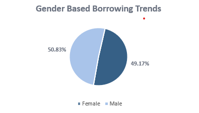

# Loan-Risk-Credit-Analysis
Exploratory analysis of 5,000 borrower records to uncover what really drives loan approval decisions beyond credit score.
# Loan Risk & Credit Analysis

# Overview

I always assumed a high credit score meant your loan would be approved. This dataset proved me wrong.
This project analyzes 5,000 borrower records to uncover the real factors behind loan approval decisions going beyond credit score to examine income stability, debt ratio, employment profile, age, location, and gender.

# Problem Statement

Credit score is often treated as the single most important factor in loan approval. But is it really enough? This analysis challenges that assumption using real borrower data.

# Dataset

 • 5,000 borrower records
 • Key variables: Age,
 City, 
 Gender, 
 Income, 
 Debt Ratio, 
 Employment Profile, 
 Credit Score, 
 Loan Status

# Tools Used

 • Power BI Dashboard and visualizations
 
 • Microsoft Excel Data cleaning and preparation

# Key Findings

# Borrowing by Age Group
Borrowers aged 56–69 recorded the highest total borrowing at $26.1M, suggesting larger life commitments drive bigger loan demands.

# Borrowing by City
Chicago leads at $26.1M, but all four cities showed consistently high borrowing levels location clearly plays a role in credit risk.

# Gender-Based Trends
Borrowing is almost evenly split females at 50.83% and males at 49.17% it highlighting the need for more inclusive, borrower-focused credit products.

# Experience & Creditworthiness
More work experience does not always translate to a stronger credit profile. Repayment history and debt burden matter more.

# The Big Reveal

High credit score? Still not a guaranteed approval.

This analysis shows that loan decisions are shaped by a combination of factors. Never assume. Let the data speak.

# Dashboard Preview

You can connect with me on [Linkedin](http://linkedin.com/in/gifted-ajamu), [x](https://x.com/giftedajamu?s=21)
